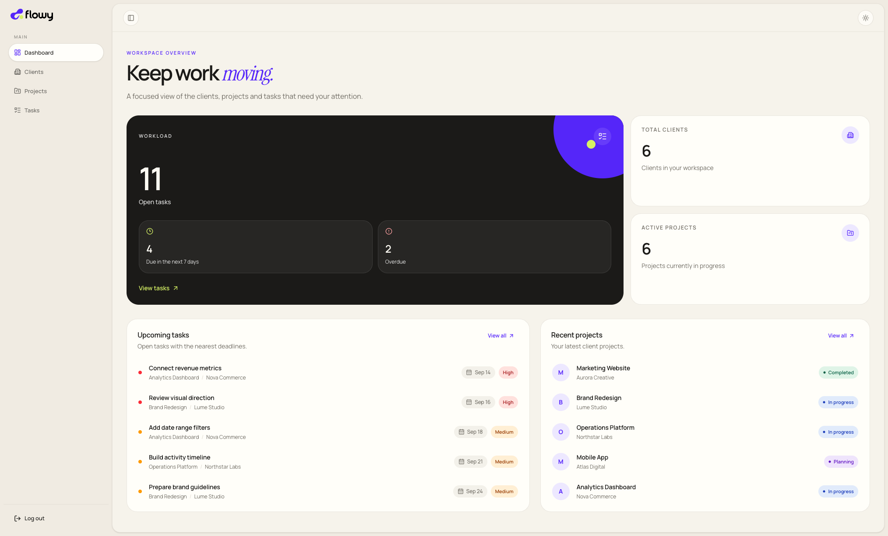
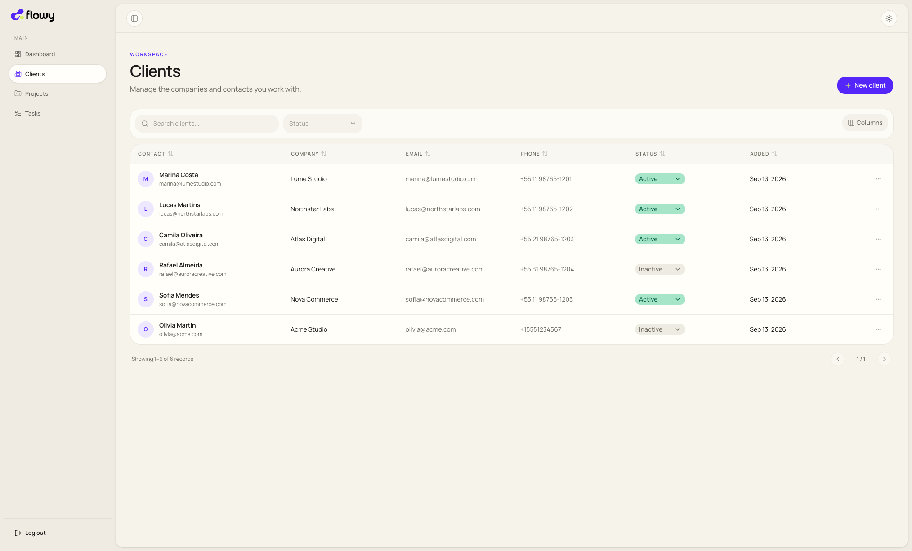
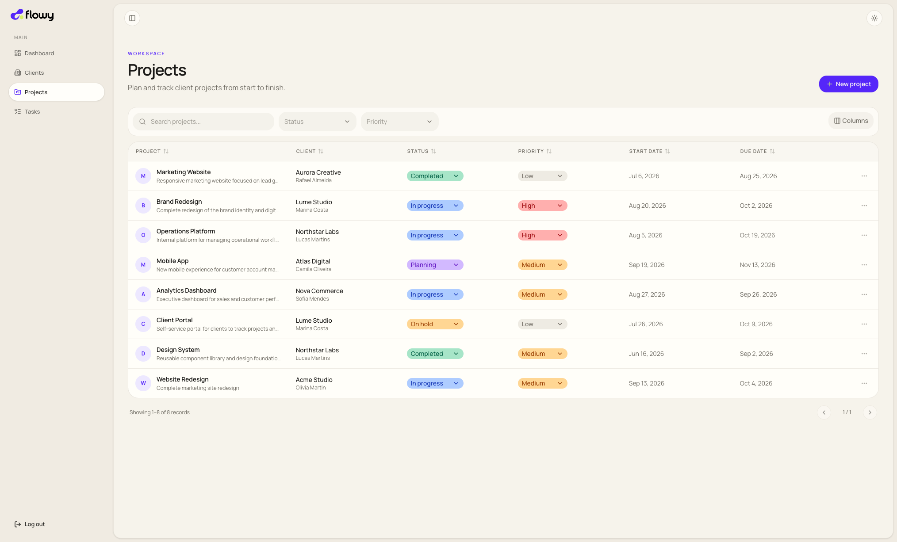
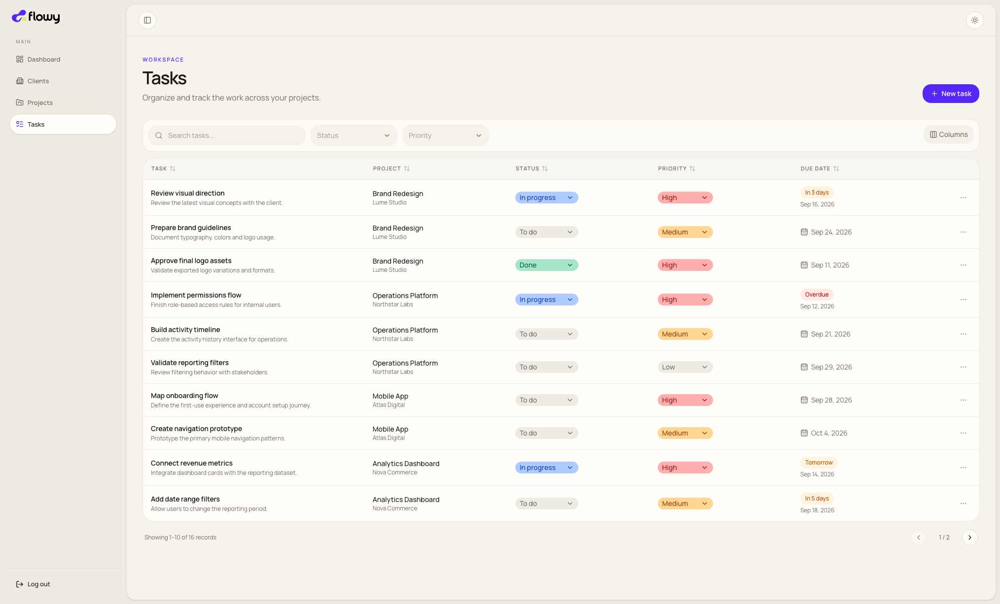
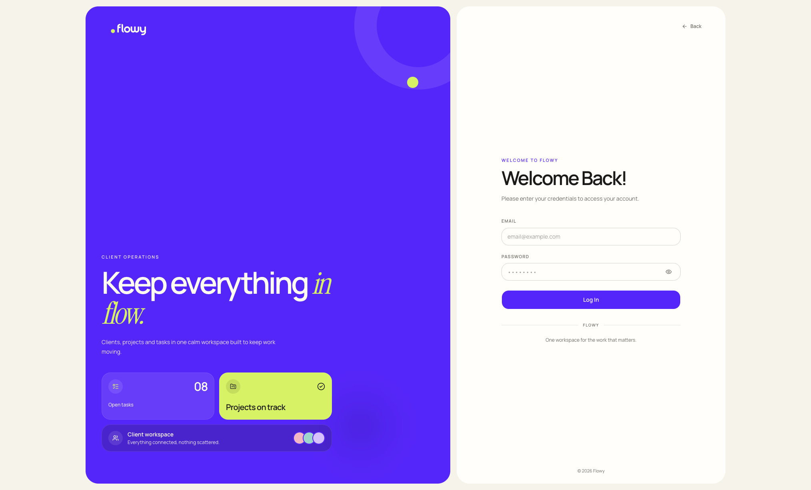
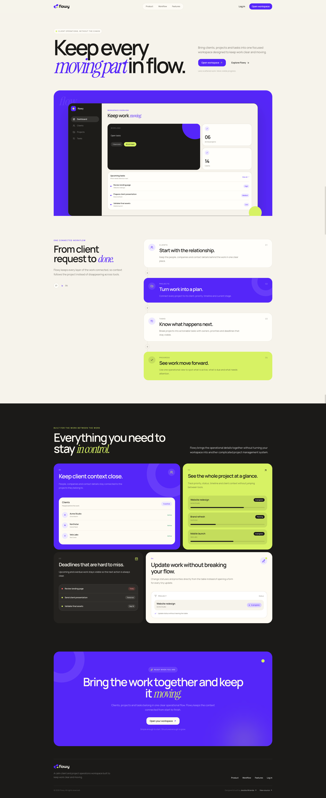

# Flowy

A modern operations workspace for managing clients, projects, and tasks in one place.

Built as a full-stack portfolio project focused on frontend architecture, product thinking, usability, and scalable UI patterns.

## Live Demo

[Open Flowy](https://flowy-black.vercel.app/en)

## Overview

Flowy is a client and project operations platform designed to help teams organize their day-to-day work without unnecessary complexity.

The product combines client management, project tracking, task workflows, dashboard insights, filtering, inline editing, and responsive interfaces in a single workspace.

## Screenshots

### Dashboard



### Clients



### Projects



### Tasks



### Authentication



### Landing Page



## Features

- Client management with status tracking and inline editing
- Project management with priorities, statuses, and date ranges
- Task management with deadlines, priorities, and workflow statuses
- Dashboard with operational metrics and recent activity
- Search, filters, sorting, pagination, and column resizing
- Responsive application shell with collapsible navigation
- Light and dark themes
- Internationalization with English, Portuguese, and Spanish
- Authentication and protected routes
- Empty, loading, and error states
- Accessible keyboard interactions
- Automated unit, integration, and end-to-end tests

## Tech Stack

### Frontend

- Next.js 16
- React 19
- TypeScript
- Tailwind CSS
- shadcn/ui
- Base UI
- TanStack Table
- React Hook Form
- Zod
- next-intl

### Backend & Infrastructure

- Supabase
- PostgreSQL
- Supabase Auth
- Row Level Security

### Testing & Quality

- Vitest
- React Testing Library
- Playwright
- axe-core
- ESLint
- Prettier

## Product Highlights

### Data-heavy interfaces

Flowy uses reusable table abstractions to support sorting, filtering, pagination, resizing, selection, and inline interactions while keeping the UI consistent across different entities.

### Frontend architecture

The application is organized around reusable components, shared states, feature-based modules, typed schemas, and clear separation between product logic and presentation.

### Internationalization

The interface supports:

- English
- Portuguese
- Spanish

Routes and interface content are localized with `next-intl`.

### Responsive UX

The application was designed for both desktop and mobile usage, including responsive navigation, sheets, forms, tables, and dashboard layouts.

## Getting Started

Clone the repository:

```bash
git clone https://github.com/jessikamiranda/flowy.git
cd flowy
```

Install the dependencies:

```bash
npm install
```

Create your local environment variables based on the project configuration and add the required Supabase credentials.

Start the development server:

```bash
npm run dev
```

Open:

```text
http://localhost:3000
```

## Quality Checks

Run the project quality checks:

```bash
npm run check
```

Run the complete validation pipeline:

```bash
npm run validate
```

Run the end-to-end test suite:

```bash
npm run e2e
```

Run accessibility tests separately:

```bash
npm run e2e:a11y
```

Create a production build:

```bash
npm run build
```

## Project Goals

Flowy was built as a portfolio project to demonstrate:

- Frontend architecture in a real product-like application
- Complex data management interfaces
- Reusable component design
- Responsive UI development
- Internationalization
- Authentication and authorization
- Automated testing
- Product-oriented frontend engineering

## Author

**Jessika Miranda**

Frontend Software Engineer focused on React, Next.js, TypeScript, and product-driven interfaces.

- LinkedIn: [linkedin.com/in/jessika-miranda](https://www.linkedin.com/in/jessika-miranda)
